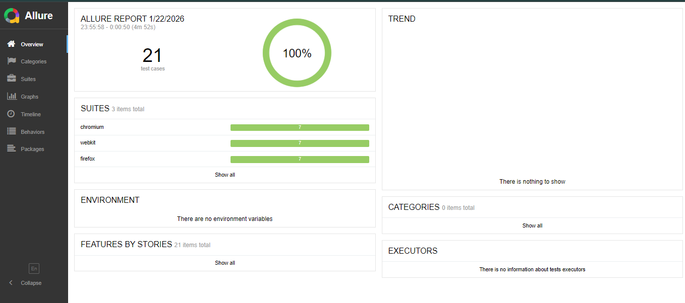

# 🤖 Mobile TopUp Store - Automated Testing Portfolio

Automated End-to-End (E2E) testing framework for a Mobile TopUp application.
Built with **Playwright**, **TypeScript**, and **Page Object Model (POM)** design pattern.

## 🏆 Test Results (Allure Report)

> **Note:** The test suite achieves **100% Pass Rate** on Chromium and WebKit.
> *(Known Issue: Firefox occasionally throws a generic `browserContext.close` protocol error during teardown, unrelated to test logic.)*

## 🛠 Tech Stack
- **Framework:** Playwright
- **Language:** TypeScript
- **Design Pattern:** Page Object Model (POM)
- **Reporting:** Allure Report
- **CI/CD:** GitHub Actions

## 🧪 Test Coverage
| Category | Test Scenarios |
| :--- | :--- |
| **API** | `POST /register`, `POST /login` (Valid & Invalid cases), Duplicate User handling |
| **UI Auth** | User Registration, Login Flow, **Forgot Password (Mock OTP)** |
| **E2E** | Full Purchase Flow (Select Package -> Add-on -> Payment -> **DB Validation**) |

## 🚀 How to Run
1. Clone the repo
2. `npm install`
3. `npx playwright test`
4. `npx allure-commandline serve allure-results`