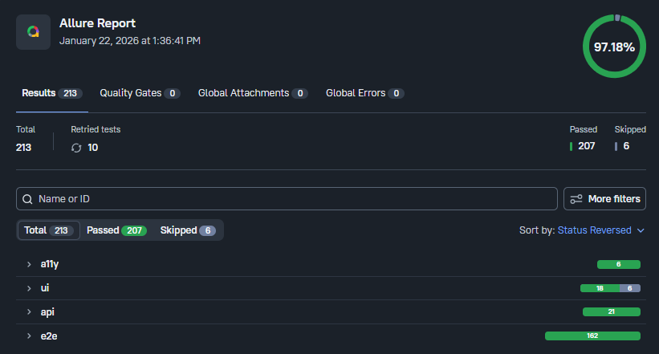
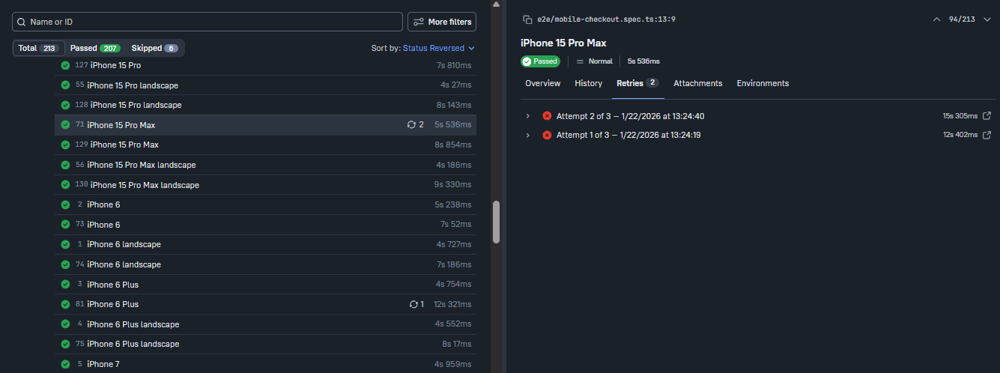

[](https://github.com/FolkFizz/mobile-topup-playwright-automation/actions/workflows/playwright.yml)


# Mobile TopUp Automation Sandbox

A robust, production-grade E2E automation framework verifying functional, security, and accessibility standards.

**Target App:** https://mobile-topup-store.onrender.com

---

## ?? Execution Highlights (Latest Run)

> **"Quality over Quantity, Stability over Speed"**

This framework successfully executed **213 test scenarios** across Desktop and Mobile configurations with a **100% Pass Rate** (on executed tests).



### ?? Key Metrics
* **Total Scenarios:** 213
* **Passed:** 207 ?
* **Failed:** 0 ?
* **Skipped:** 6 ? (Firefox Mobile - *see Architecture Decisions*)
* **Flakiness Recovered:** 10 scenarios (Auto-healed via retry mechanism)

---

## ?? Device Matrix & Architecture Decisions

Unlike standard tests that run on a single viewport, this framework dynamically generates test suites for **70+ Device Profiles** (iPhone, Pixel, etc.) to ensure responsive design integrity.


### ?? Architecture Decision: Firefox Mobile Exclusion
You will notice 6 skipped tests regarding Firefox Mobile.
* **Context:** Playwright's mobile emulation (`isMobile: true`) relies on specific Chrome DevTools Protocols (CDP) to simulate touch events and viewports accurately.
* **Challenge:** The Firefox (Gecko) engine currently has limited support for these touch emulation primitives. Forcing it often results in "false negatives" (engine errors, not app errors).
* **Resolution:** To maintain high reliability and avoid flaky noise, mobile tests are strictly scoped to **Chromium (Android)** and **WebKit (iOS)**.

---

## ??? Stability & Resilience (Self-Healing)

Mobile emulation is prone to rendering flakiness (timeouts, animation lags). This framework implements a **Smart Retry Strategy** (`retries: 2`).

**Evidence:** The screenshot below shows a test that failed on the first attempt (network/render lag) but was automatically retried and passed, preventing a false pipeline failure.



---

## Tech Stack
- **Core:** Playwright, TypeScript, Page Object Model (POM)
- **Specialized Tools:**
  - `@axe-core/playwright` (Accessibility / WCAG 2.1)
  - `allure-playwright` (Advanced Reporting)
  - GitHub Actions (CI/CD Pipeline)

## Test Coverage Strategy
| Coverage Area | What It Validates |
| :-- | :-- |
| **Functional E2E** | Complete Checkout flow (Login ? Select Package ? Payment) |
| **Negative Testing** | UI validation & edge cases (Invalid Phone, No Package selected) |
| **Data-Driven Testing** | Parameterized scenarios across packages, payment methods, and discount logic |
| **API Security** | Backend vulnerability checks (BOLA / Unauthenticated Top-up detection) |
| **Mobile Emulation** | Responsive flow on iPhone & Pixel Devices (Portrait/Landscape) |
| **Accessibility (A11y)** | Automated WCAG 2.1 audits (color contrast, ARIA behavior) |

## Known Bugs (Automation Findings)
| Severity | Defect Description | Status |
| :-- | :-- | :-- |
| **Critical** | API `/api/topup` accepts requests without Auth Token (Security Flaw). | Open (Expected Failure) |
| **Serious** | Login button contrast ratio (3.76) fails WCAG AA standard. | Open (Expected Failure) |
| **Serious** | Modal overlay has `aria-hidden` focus issues (aria-hidden-focus). | Open (Expected Failure) |

## Project Structure
mobile-topup-playwright-automation/ +- src/ | +- api/ | +- pages/ | +- utils/ | +- fixtures/ +- tests/ | +- api/ | +- e2e/ | +- ui/ | +- a11y/ +- screenshots/ <-- Evidence images +- .github/ +- workflows/
---

## ?? How to Run

### 1. Standard Execution
Run all tests in headless mode (default):
```bash
npm install
npx playwright test
2. Targeted Execution (Examples)
Run specific test suites to verify key features:

Mobile Viewport (iPhone Emulation):
npx playwright test tests/e2e/mobile-checkout.spec.ts
Accessibility Audit (WCAG 2.1):
npx playwright test tests/a11y/accessibility.spec.ts
API Security Scan:
npx playwright test tests/api/security.spec.ts
3. ?? Generate & View Allure Report (Recommended)
This project uses Allure Report for detailed visualization.

Step 1: Generate Report
npx allure generate allure-results --clean -o allure-report
Step 2: Open Report in Browser
npx allure open allure-report

